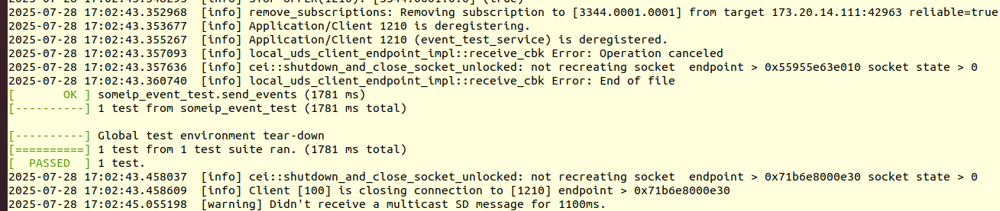

# event-tests
    cd xxxx/build/test/network_tests/event_tests
## service
    gedit event_test_slave_tcp.json
    # 输入service端IP
    "unicast":"XXX.XXX.XXX.XXX" => "unicast":"173.20.14.127"

    # 执行
    ./event_test_slave_starter.sh TCP
## client
    gedit event_test_master.json
    # 输入client端IP
    "unicast":"XXX.XXX.XXX.XXX" => "unicast":"173.20.14.111"

    #执行
    ./event_test_master_starter.sh PAYLOAD_FIXED TCP
## 结果

## 修改
### 问题
1. service和client端的demo中，使用和json配置文件有误
2. 错误的地方是
    1. service端执行的shell脚本像在执行client端脚本
    2. client端执行的shell脚本像在执行service端脚本
### 改后的执行操作
    # service端
    ./event_test_master_starter.sh TCP

    # client端
    ./event_test_slave_starter.sh PAYLOAD_FIXED TCP