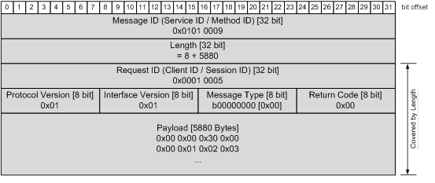
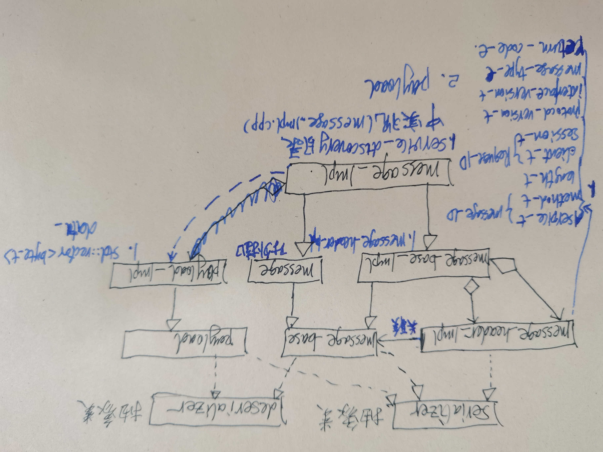

# 序列化和反序列化
## 序列化
1. 将数据结构或对象转换成二进制串的过程
## 反序列化
1. 将在序列化过程中产生的二进制串转换成数据结构或对象的过程

# SOMEIP message
## SOMEIP message结构图

1. 文档位置：《AUTOSAR_FO_PRS_SOMEIPProtocol.pdf》4.1.4 Serialization of Data Structures
2. message header基本是由8bit、16bit、32bit组成
3. payload不确定
4. 序列化
    4.1 基础类型、结构体、string、array、enum、bitfield、union/variant

# vSOMEP meesage实现
## 序列化和反序列化实现

### message header和payload
    vsomeip/implementation/message/include/deserializer.hpp
    vsomeip/implementation/message/include/message_base_impl.hpp
    vsomeip/implementation/message/include/message_header_impl.hpp
    vsomeip/implementation/message/include/message_impl.hpp
    vsomeip/implementation/message/include/payload_impl.hpp
    vsomeip/implementation/message/include/serializer.hpp

    vsomeip/implementation/message/src/deserializer.cpp
    vsomeip/implementation/message/src/message_base_impl.cpp
    vsomeip/implementation/message/src/message_header_impl.cpp
    vsomeip/implementation/message/src/message_impl.cpp
    vsomeip/implementation/message/src/payload_impl.cpp
    vsomeip/implementation/message/src/serializer.cpp

    vsomeip/implementation/service_discovery/include/message_impl.hpp
    vsomeip/implementation/service_discovery/src/message_impl.cpp