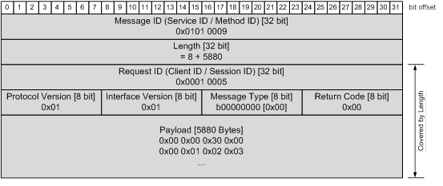
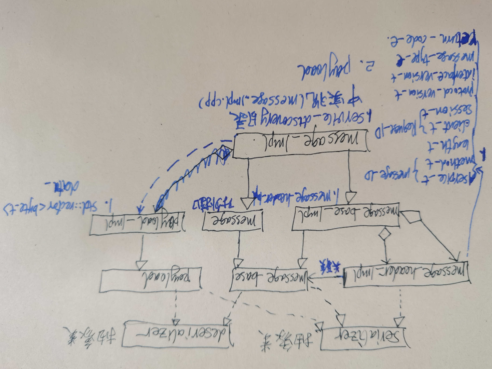

# SOMEIP message

## 序列化和反序列化
### 序列化
1. 将数据结构或对象转换成二进制串的过程
### 反序列化
1. 将在序列化过程中产生的二进制串转换成数据结构或对象的过程

## SOMEIP message结构图

1. 文档位置：《AUTOSAR_FO_PRS_SOMEIPProtocol.pdf》4.1.4 Serialization of Data Structures
2. message header基本是由8bit、16bit、32bit组成
3. payload不确定
4. 序列化
    4.1 基础类型、结构体、string、array、enum、bitfield、union/variant

# vSOMEP meesage实现
## 序列化和反序列化实现
1. message 类关系图

### message header和payload代码实现目录
    vsomeip/implementation/message/include/deserializer.hpp
    vsomeip/implementation/message/include/message_base_impl.hpp
    vsomeip/implementation/message/include/message_header_impl.hpp
    vsomeip/implementation/message/include/message_impl.hpp
    vsomeip/implementation/message/include/payload_impl.hpp
    vsomeip/implementation/message/include/serializer.hpp

    vsomeip/implementation/message/src/deserializer.cpp
    vsomeip/implementation/message/src/message_base_impl.cpp
    vsomeip/implementation/message/src/message_header_impl.cpp
    vsomeip/implementation/message/src/message_impl.cpp
    vsomeip/implementation/message/src/payload_impl.cpp
    vsomeip/implementation/message/src/serializer.cpp

    vsomeip/implementation/service_discovery/include/message_impl.hpp
    vsomeip/implementation/service_discovery/src/message_impl.cpp

### payload序列化代码实现
#### 序列化
1. vsomeip/implementation/message/src/serializer.cpp

        bool serializer::serialize(const uint8_t _value) {
            data_.push_back(_value);
            return true;
        }
    
        bool serializer::serialize(const uint16_t _value) {
            uint8_t nvalue[2] = {0};
            bithelper::write_uint16_le(_value, nvalue);
            data_.push_back(nvalue[1]);
            data_.push_back(nvalue[0]);
            return true;
        }

        bool serializer::serialize(const uint32_t _value, bool _omit_last_byte) {
            uint8_t nvalue[4] = {0};
            bithelper::write_uint32_le(_value, nvalue);

            if (!_omit_last_byte) {
                data_.push_back(nvalue[3]);
            }
            data_.push_back(nvalue[2]);
            data_.push_back(nvalue[1]);
            data_.push_back(nvalue[0]);
            return true;
        }

        bool serializer::serialize(const uint8_t *_data, uint32_t _length) {
            try {
                data_.insert(data_.end(), _data, _data + _length);
            } catch(const std::bad_alloc &e) {
                VSOMEIP_ERROR << "Couldn't allocate memory in serializer::serialize(*_data, length)" << e.what();
                return false;
            }
            return true;
        }

        bool serializer::serialize(const std::vector<byte_t> &_data) {
            try {
                data_.insert(data_.end(),_data.begin(), _data.end());
            } catch(const std::bad_alloc &e) {
                VSOMEIP_ERROR << "Couldn't allocate memory in serializer::serialize(vector)" << e.what();
                return false;
            }
            return true;
        }
    
#### 反序列化
1. vsomeip/implementation/message/src/deserializer.cpp

        bool deserializer::deserialize(uint8_t& _value) {
            if (0 == remaining_)
                return false;

            _value = *position_++;

            remaining_--;
            return true;
        }

        bool deserializer::deserialize(uint16_t& _value) {
            if (2 > remaining_)
                return false;

            uint8_t byte0, byte1;
            byte0 = *position_++;
            byte1 = *position_++;
            remaining_ -= 2;

            uint8_t payload[2] = {byte0, byte1};
            _value = bithelper::read_uint16_be(payload);

            return true;
        }

        bool deserializer::deserialize(uint32_t &_value, bool _omit_last_byte) {
            if (3 > remaining_ || (!_omit_last_byte && 4 > remaining_))
                return false;

            uint8_t byte0 = 0, byte1, byte2, byte3;
            if (!_omit_last_byte) {
                byte0 = *position_++;
                remaining_--;
            }
            byte1 = *position_++;
            byte2 = *position_++;
            byte3 = *position_++;
            remaining_ -= 3;

            uint8_t payload[4] = {byte0, byte1, byte2, byte3};
            _value = bithelper::read_uint32_be(payload);

            return true;
        }

        bool deserializer::deserialize(uint8_t *_data, std::size_t _length) {
            if (_length > remaining_)
                return false;

            std::memcpy(_data, &data_[static_cast<std::vector<byte_t>::size_type>(position_ - data_.begin())], _length);
            position_ += static_cast<std::vector<byte_t>::difference_type>(_length);
            remaining_ -= _length;

            return true;
        }

        bool deserializer::deserialize(std::string &_target, std::size_t _length) {
            if (_length > remaining_ || _length > _target.capacity()) {
                return false;
            }
            _target.assign(position_, position_ + static_cast<std::vector<byte_t>::difference_type>(_length));
            position_ += static_cast<std::vector<byte_t>::difference_type>(_length);
            remaining_ -= _length;

            return true;
        }

        bool deserializer::deserialize(std::vector< uint8_t >& _value) {
            if (_value.capacity() > remaining_)
                return false;

            _value.assign(position_, position_
                    + static_cast<std::vector<byte_t>::difference_type>(_value.capacity()));
            position_ += static_cast<std::vector<byte_t>::difference_type>(_value.capacity());
            remaining_ -= _value.capacity();

            return true;
        }
### message header序列化代码实现
#### 序列化
1. vsomeip/implementation/message/src/message_header_impl.cpp

        bool message_header_impl::serialize(serializer *_to) const {
            return (0 != _to
                    && _to->serialize(service_)
                    && _to->serialize(method_)
                    && _to->serialize(owner_->get_length())
                    && _to->serialize(client_)
                    && _to->serialize(session_)
                    && _to->serialize(protocol_version_)
                    && _to->serialize(interface_version_)
                    && _to->serialize(static_cast<uint8_t>(type_))
                    && _to->serialize(static_cast<uint8_t>(code_)));
        }

#### 反序列化
1. vsomeip/implementation/message/src/message_header_impl.cpp
    
        bool message_header_impl::deserialize(deserializer *_from) {
            bool is_successful;

            uint8_t tmp_message_type, tmp_return_code;

            is_successful = (0 != _from
                    && _from->deserialize(service_)
                    && _from->deserialize(method_)
                    && _from->deserialize(length_)
                    && _from->deserialize(client_)
                    && _from->deserialize(session_)
                    && _from->deserialize(protocol_version_)
                    && _from->deserialize(interface_version_)
                    && _from->deserialize(tmp_message_type)
                    && _from->deserialize(tmp_return_code));

            if (is_successful) {
                type_ = static_cast< message_type_e >(tmp_message_type);
                code_ = static_cast< return_code_e >(tmp_return_code);
            }

            return is_successful;
        }
